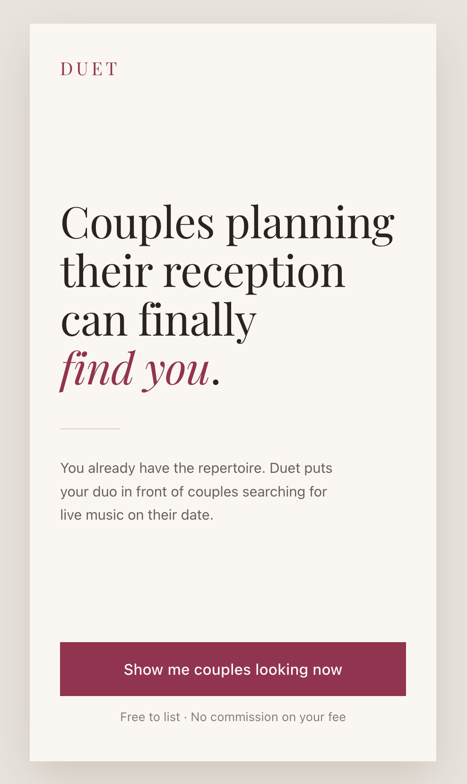
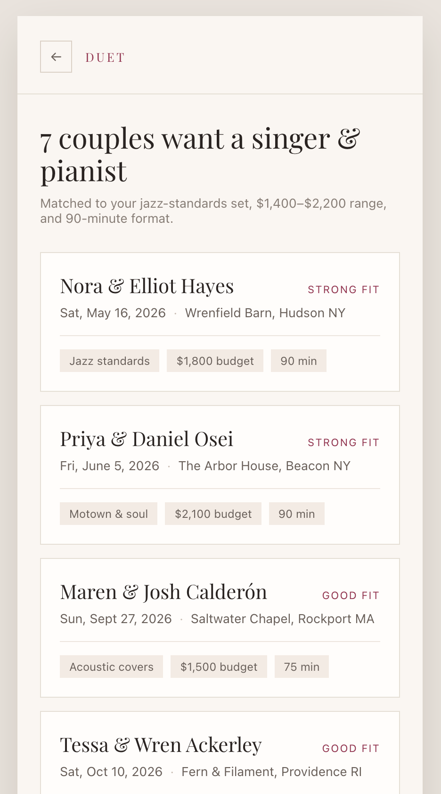
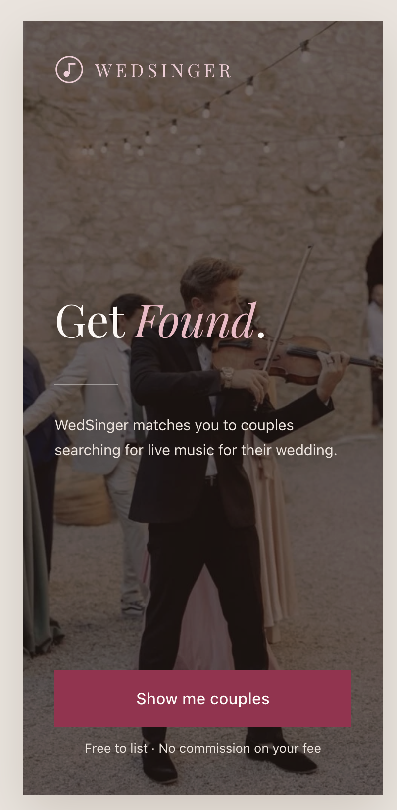
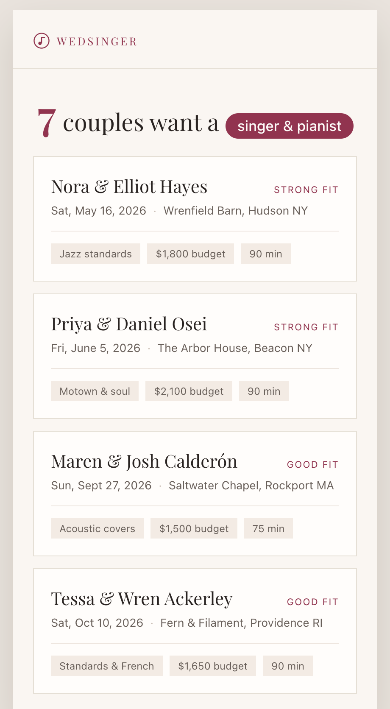

# WedSinger — Wedding Singer Booking Prototype

## 1. Problem, Persona, Capability, and Value

**Need:** Singer/pianist duos have a ready-to-perform act but may struggle to find weddings when they do not yet have a wedding network.

**Persona:** A singer/pianist duo that has everything ready to perform but needs a way to find weddings and become known to couples looking for live music.

**Primary Capability:** WedSinger matches wedding singers with couples looking for live music. Singers can view matches, see wedding details, communicate with couples, and book through the app.

**Fundamental Value:** **Visibility.** WedSinger helps ready-to-book singers become discoverable to couples actively looking for wedding music.

## 2. Three Screens

| Screen | Single Job | Why It Earned a Slot | Design Question |
|---|---|---|---|
| **Landing** | Communicate what WedSinger does and lead singers to potential matches. | It is the first screen and must communicate the app's purpose immediately. | Does the landing screen communicate the primary capability and value at first glance? |
| **Matches** | Show weddings that could be a fit. | It delivers the main value by giving singers visibility into opportunities. | Can singers quickly understand their matches and know what to do next? |
| **Match Detail** | Help singers evaluate a specific wedding and decide whether to message or book. | Singers need more information before taking action. | Does the screen provide the right information and actions to move from discovery to booking? |

## 3. Design Question Plan

**Need:** “Think about the last time you were trying to find a wedding to sing at. What did you do to try to find one?”  
**Prediction:** They may rely on people they know, social media, word of mouth, or other informal methods because they do not yet have a strong wedding network.  
**Based on:** WedSinger's purpose of helping singers find weddings without an existing network.

**Value:** “If couples who are already looking for wedding music could discover you, what would that be worth to you? Why?”  
**Prediction:** They will value increased visibility and access to opportunities they might otherwise miss.  
**Based on:** WedSinger's fundamental value of visibility.

**Persona:** “How often are you looking for wedding gigs, and what do you usually do when you don't have one lined up?”  
**Prediction:** They want wedding opportunities regularly but may not have a consistent way to find them.  
**Based on:** The persona's need to find weddings while building a network.

**Capability:** “If I showed you this app for a few seconds and then asked what it does, what would you say it's for?”  
**Prediction:** They will recognize that it connects wedding singers with couples looking for wedding music.  
**Based on:** The landing screen's headline, supporting message, and primary CTA.

**Capability:** “If you wanted to find a wedding to sing at, what would you click first, and what would you expect to happen?”  
**Prediction:** They will look for a way to see potential couples or matches and expect the action to lead to wedding opportunities.  
**Based on:** The landing screen's primary action and Matches screen.

## 4. Design Justification and First Read

**Landing:** “Get Found” immediately communicates the main value, supported by “WedSinger matches you to couples searching for live music for their wedding.” The “Show me couples” button gives the screen a clear primary action. The wedding imagery and logo, which combines a wedding band with a music note, reinforce the wedding-music context.

The landing screen prioritizes its main job. Secondary information such as “Free to list” and “No commission on your fee” is present without competing with the primary message.

**Grouping and hierarchy:** On the Matches screen, size and weight emphasize the number of available matches, while the “Singer and Pianist” pill groups the relevant type of request. Each wedding is visually grouped with its related information. On the Match Detail screen, wedding details, the couple's note, requested music, and message/book actions are grouped according to their purpose.

Screens 2 and 3 stay on mission: **discover an opportunity → evaluate the match → take action.** The logo consistently returns to the landing screen, and the back arrow with the “Matches” pill provides clear navigation back to the matches.

### What the AI Initially Got Wrong

The initial AI version was too wordy and did not use enough visual hierarchy to draw attention to important information. I shortened the messaging from “Couples planning their reception can finally find you” to **“Get Found”** and changed “Show me couples looking now” to **“Show me couples.”**

The AI also named the app **“Duet,”** which was too specific to the persona and did not clearly communicate what the app was for. I changed the name to **“WedSinger”** because it communicates the product's purpose more directly. I also added a logo because the AI did not provide one. The logo uses a wedding band with a music note to reinforce the product's purpose.

On the Matches screen, the AI displayed “Seven couples looking for A singer and pianist” with the same visual treatment. I made the **7 larger and bolder** and placed **“Singer and Pianist” in a pill** so the number of opportunities and type of match are easier to scan.

On the Match Detail screen, the AI placed the logo in the top right. I moved it to the top left so it stays consistent across screens and functions as a clear way to return home. I also added a back arrow with a **“Matches” pill** to make navigation back to the matches more obvious.

These changes were motivated by **signaling, visual hierarchy, Gestalt grouping, and navigation**, rather than personal color preferences.

### Before and After

**Before: Initial AI Version**

**After: Revised WedSinger Version**

The original AI version was called Duet, had longer copy, limited visual hierarchy, and did not emphasize the most important information.

The revised version is called WedSinger, uses shorter messaging, has a wedding/music logo, emphasizes important information through hierarchy and grouping, and has clearer navigation.

## Live Prototype

[Open the WedSinger prototype](https://wedsingerprototype.vercel.app/)
